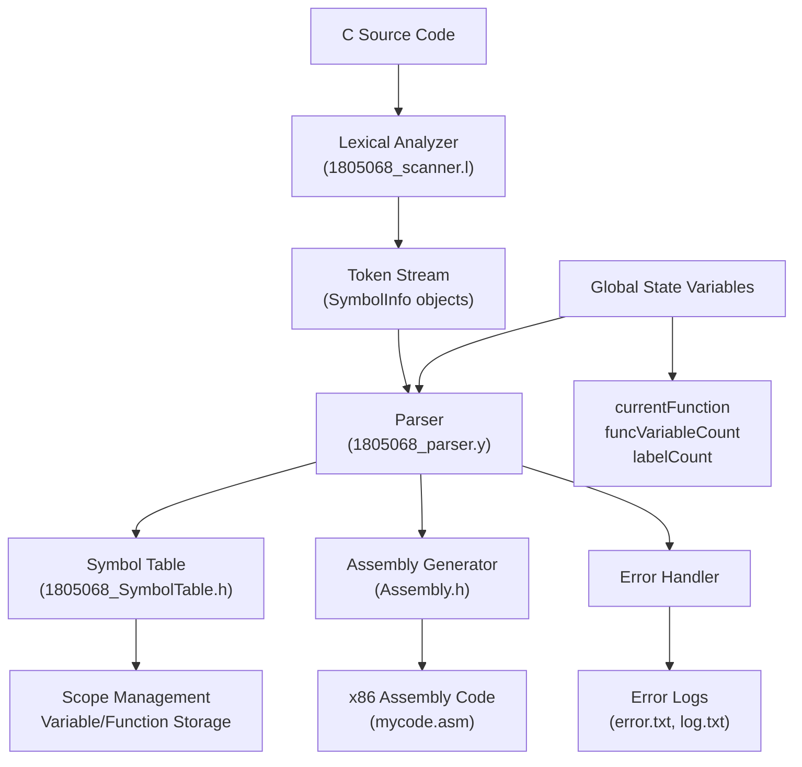

# C Compiler with Intermediate Code Generation

A complete C compiler implementation that transforms C source code into x86 assembly language through lexical analysis, syntax analysis, semantic analysis, and code generation phases. [1](#0-0) 

## Main Building Blocks

### 1. Lexical Analysis Engine
**Files:** `1805068_scanner.l`, `lex.yy.c`

The lexical analyzer tokenizes C source code using Flex, recognizing keywords, identifiers, constants, operators, and delimiters. [2](#0-1)  It creates `SymbolInfo` objects for each token and handles complex constructs like comments and string literals through state-based processing. [3](#0-2) 

### 2. Syntax Analysis & Parser
**Files:** `1805068_parser.y`, `1805068_parser.tab.c`, `1805068_parser.tab.h`

A LALR(1) parser built with GNU Bison that validates C grammar and performs integrated semantic analysis and code generation. [4](#0-3)  The parser handles function definitions, variable declarations, control flow statements, and expressions while simultaneously generating x86 assembly code. [5](#0-4) 

### 3. Symbol Management System
**Files:** `1805068_SymbolTable.h`, `1805068_ScopeTable.h`

A hierarchical symbol table system that manages identifier scoping using a stack-based approach. [6](#0-5)  It supports nested scopes with automatic scope entry/exit and provides symbol lookup that traverses the scope hierarchy. [7](#0-6) 

### 4. Assembly Code Generator
**Files:** `Assembly.h`

Generates x86 assembly code with functions for file initialization, code emission, and runtime support. [8](#0-7)  Includes a complete integer printing function for program output. [9](#0-8) 

## System Architecture & Connections



## Data Flow

1. **Input Processing**: The lexical analyzer reads C source code and creates `SymbolInfo` tokens [10](#0-9) 

2. **Parsing & Analysis**: The parser consumes tokens, validates syntax, manages symbol tables, and generates assembly code in a single pass [11](#0-10) 

3. **Symbol Management**: The symbol table maintains hierarchical scopes for proper identifier resolution [12](#0-11) 

4. **Code Generation**: Assembly instructions are emitted directly during parsing, with stack frame management and register allocation [13](#0-12) 

5. **Output**: The system produces executable x86 assembly code along with detailed compilation logs [14](#0-13) 

## Key Features

- **Integrated Compilation**: Single-pass compilation with simultaneous parsing and code generation
- **Hierarchical Scoping**: Proper C-style lexical scoping with nested function and block scopes  
- **x86 Target**: Generates DOS-compatible 16-bit x86 assembly code
- **Error Recovery**: Comprehensive error detection and reporting throughout all phases
- **Optimization**: Basic peephole optimization for redundant instruction elimination

## Notes

The compiler uses a traditional architecture but performs code generation during parsing rather than building an intermediate representation, making it efficient for educational purposes while demonstrating all major compiler phases. <cite/>

Wiki pages you might want to explore:
- [Lexical Analysis (showvikbiswas/compiler-icg)](/wiki/showvikbiswas/compiler-icg#2)
- [Syntax Analysis (showvikbiswas/compiler-icg)](/wiki/showvikbiswas/compiler-icg#3)
- [Symbol Management System (showvikbiswas/compiler-icg)](/wiki/showvikbiswas/compiler-icg#4)

### Citations

**File:** 1805068_parser.y (L21-56)
```text
SymbolTable *table;

FILE *logFile;
FILE *errorFile;
FILE *inputFile;
FILE *codeFile;
FILE *optimizedFile;

string str;
string vartype;
string program = "";
string statementsStr = "";
string returnType;

int returnLineNo;

// ASM  Variables
int funcVariableCount = 0;
int funcParameterCount = 0;
int addOrSub = 0;
SymbolInfo *currentFunction;
bool inFactorArgList = false;
bool inForLoopThird = false;
int labelCount = 0;
stack<string> ifElseLabelStack;
stack<string> forThirdStack;
stack<string> forLabelStack;
stack<string> forLabelStack2;
string logicOpLabel1, logicOpLabel2, logicOpLabel3;
string ifLabel1, ifLabel2, ifLabel3;
string forLabel1, forLabel2, forLabel3, forExprStmt;
string whileLabel1, whileLabel2;
stack<string> whileLabelStack, whileLabelStack2;
stack<string> functionArgumentASMStack;
string simpleExpStr  = "";
string forThirdStr = "";
```

**File:** 1805068_parser.y (L89-96)
```text
start : { initializeASMFile(codeFile);} program
	{
		//write your code in this block in all the similar blocks below
		$$ = $2;
		logData(logFile, yylineno, "start : program", "");
		writePrintFunction(codeFile);
		endASMFile(codeFile);
	}
```

**File:** 1805068_parser.y (L485-501)
```text
		| type_specifier ID LPAREN RPAREN 
																					{
																						currentFunction = $2;
																						string type = $1;
																						string name = $2->name;	
																						returnType = "";
																						string ASMText = name + " PROC";
																						printToASM(ASMText, codeFile);
																						printToASM("PUSH BP", codeFile);
																						printToASM("MOV BP, SP", codeFile);
																						SymbolInfo *current = table->lookUp(name);

																						if (name == "main")
																						{
																							printToASM("MOV AX, @DATA", codeFile);
																							printToASM("MOV DS, AX", codeFile);
																						}
```

**File:** 1805068_parser.y (L751-763)
```text
																					
																					// if the variable is in global scope, add to global variables
																					if (regex_match(table->getScopeID(), regex("\\d+"))) {
																						addGlobalVariable((char*) s.c_str(), codeFile);
																						symbolInfo.setGlobal(true);
																					}
																					else {
																						// add as local variable
																						funcVariableCount++;
																						symbolInfo.setOffset(funcVariableCount*-2);
																						// printf("C %d", symbolInfo.getOffset());
																						printToASM("SUB SP, 2", codeFile);
																					}
```

**File:** 1805068_parser.y (L2020-2033)
```text
int main(int argc,char *argv[])
{
	table = new SymbolTable(30);
	inputFile = fopen("input.txt", "r");
	codeFile = fopen("mycode.asm", "w");
	logFile = fopen("log.txt", "w");
	errorFile = fopen("error.txt", "w");
	// optimizedFile = fopen("myoptimizedfile.asm", "w");
	yyin = inputFile;
	yyparse();
	table->printAllScopeTables(logFile);
	fprintf(logFile, "Total Lines: %d\n", yylineno);
	fprintf(logFile, "Total Errors: %d\n", errorCount);

```

**File:** 1805068_scanner.l (L181-217)
```text
"if"                                                        {return IF;}
"else"                                                      {return ELSE;}
"for"                                                       {return FOR;}
"while"                                                     {return WHILE;}
"int"                                                       {return INT;}
"float"                                                     {return FLOAT;}
"double"                                                    {return DOUBLE;}
"char"                                                      {return CHAR;}
"return"                                                    {return RETURN;}
"void"                                                      {return VOID;}
"println"	                                                {return PRINTLN;}

{DIGIT}+                                                    { SymbolInfo *s = new SymbolInfo(yytext, (char *)"CONST_INT"); yylval.sym = s; return CONST_INT; }
({DIGIT}*\.?{DIGIT}+|{DIGIT}+\.)(E(\+|\-)?{DIGIT}+)?        { SymbolInfo *s = new SymbolInfo(yytext, (char *)"CONST_FLOAT"); yylval.sym = s; return CONST_FLOAT; }

'({LETTER}|{DIGIT})'|'\\[nt\\'afrbv0]'                     { SymbolInfo *s = new SymbolInfo(yytext, (char *)"CONST_CHAR"); yylval.sym = s; return CONST_CHAR; }
                                                                    

\+\+                            { SymbolInfo *s = new SymbolInfo(yytext, (char *)"INCOP"); yylval.sym = s; return INCOP; }
\-\-                            { SymbolInfo *s = new SymbolInfo(yytext, (char *)"INCOP"); yylval.sym = s; return DECOP; }
\+|\-                           { SymbolInfo *s = new SymbolInfo(yytext, (char *)"ADDOP"); yylval.sym = s; return ADDOP; }
"<"|"<="|">"|">="|"=="|"!="     { SymbolInfo *s = new SymbolInfo(yytext, (char *)"RELOP"); yylval.sym = s; return RELOP; }
"*"|"/"|"%"                     { SymbolInfo *s = new SymbolInfo(yytext, (char *)"MULOP"); yylval.sym = s; return MULOP; }
"="                             { return ASSIGNOP; }
"&&"|"||"                       { SymbolInfo *s = new SymbolInfo(yytext, (char *)"LOGICOP"); yylval.sym = s; return LOGICOP; }
!                               { return NOT; }
"("                             { return LPAREN; }
")"                             { return RPAREN; }
"{"                             { return LCURL; }
"}"                             { return RCURL; }
"["                             { return LTHIRD; }
"]"                             { return RTHIRD; }
","                             { return COMMA; }
";"                             { return SEMICOLON; } // NEXT UP: ID


({LETTER}|"_")({LETTER}|{DIGIT}|"_")* { SymbolInfo *s = new SymbolInfo(yytext, (char *)"ID"); yylval.sym = s; return ID; }
```

**File:** 1805068_scanner.l (L219-227)
```text
"/*"                                        BEGIN(COMMENT); slcomment = "/*"; slcommentLineNo = yylineno;
<COMMENT>(.*{NEWLINE})*.*\*\/               slcomment = slcomment + yytext; logResult("COMMENT", slcomment, slcommentLineNo); BEGIN(INITIAL);
<COMMENT>.                                  slcomment = slcomment + yytext;
<COMMENT><<EOF>>                            s = "Unterminated comment "; s += slcomment; s += yytext; logError(logFile, errorFile, slcommentLineNo, s); errorCount++; return 0;        
"//"                                        slcomment = yytext; BEGIN(SLCOMMENT); slcommentLineNo = yylineno; 
<SLCOMMENT>[^\n]*"\\"                       slcomment = slcomment + yytext + "\n";
<SLCOMMENT>[^\n]*                           slcomment = slcomment + yytext; logResult("COMMENT", slcomment, slcommentLineNo); BEGIN(INITIAL);
<SLCOMMENT><<EOF>>                          s = "Unterminated comment "; s += slcomment; s += yytext; logError(logFile, errorFile, yylineno, s); errorCount++; return 0;        
<SLCOMMENT>{NEWLINE}
```

**File:** 1805068_SymbolTable.h (L18-26)
```text
    SymbolTable(int buckets)
    {
        this->buckets = buckets;
        currentLevel = 0;
        ids.push_back(1);
        currentScopeTable = new ScopeTable(buckets);
        currentScopeTable->setID(to_string(ids[currentLevel]));
//        currentScopeTable->setUID(currentScopeTable->getUID() + 1);
    }
```

**File:** 1805068_SymbolTable.h (L28-54)
```text
    void enterScope()
    {
        ScopeTable *newScopeTable = new ScopeTable(this->buckets);
        ScopeTable *current = currentScopeTable;
        currentLevel++;
        if(currentLevel == ids.size())
        {
            ids.push_back(1);
        }
        else
        {
            if (currentLevel != 0)
                ids[currentLevel]++;
        }
        newScopeTable->setParentScope(current);
        string newID;
        if (currentScopeTable == NULL)
        {
            newID = to_string(ids[0]);
        }
        else 
        {
            newID = currentScopeTable->getID() + "." + to_string(ids[currentLevel]);
        }
        newScopeTable->setID(newID);
        currentScopeTable = newScopeTable;
    }
```

**File:** 1805068_SymbolTable.h (L56-70)
```text
    void exitScope()
    {
        if (currentScopeTable == NULL)
        {
            cout << "NO CURRENT SCOPE" << endl;
            return;
        }

        ScopeTable *newScopeTable = currentScopeTable->getParentScope();
        if (ids.size() > currentLevel)
            ids[currentLevel+1] = 0;
        currentLevel--;
        delete currentScopeTable;
        currentScopeTable = newScopeTable;
    }
```

**File:** Assembly.h (L6-15)
```text
void initializeASMFile(FILE *file)
{
    string initialCode = ".MODEL SMALL\n";
    initialCode += ".STACK 100H\n"; 
    initialCode += ".DATA\n";
    initialCode += "MINUS DB 0\n";
    initialCode += ".CODE\n";

    fprintf(file, "%s", initialCode.c_str());
}
```

**File:** Assembly.h (L22-65)
```text
void writePrintFunction(FILE *file)
{
    fprintf(file, "println_int PROC\n");
    // at this point, AX contains the number to be printed
    fprintf(file, "MOV BX, 10\n");
    fprintf(file, "XOR CX, CX\n");
    fprintf(file, "DISPLAY_LOOP:\n");
    fprintf(file, "CMP AX, 0\n");
    fprintf(file, "JGE NOT_NEGATIVE\n");
    fprintf(file, "NEG AX\n");
    fprintf(file, "MOV MINUS, 1\n");
    fprintf(file, "NOT_NEGATIVE:\n");
    fprintf(file, "XOR DX, DX\n");
    fprintf(file, "DIV BX\n");
    fprintf(file, "PUSH DX\n");
    fprintf(file, "INC CX\n");
    fprintf(file, "CMP AX, 0\n");
    fprintf(file, "JE END_DISPLAY_LOOP\n");
    fprintf(file, "JMP DISPLAY_LOOP\n");
    fprintf(file, "END_DISPLAY_LOOP:\n");
    fprintf(file, "CMP MINUS, 1\n");
    fprintf(file, "JNE NEXT_BIT\n");
    fprintf(file, "MOV AH, 2\n");
    fprintf(file, "MOV DL, '-'\n");
    fprintf(file, "INT 21H\n");
    fprintf(file, "NEXT_BIT:\n");
    fprintf(file, "FINISH_DISPLAY_LOOP:\n");
    fprintf(file, "POP DX\n");
    fprintf(file, "ADD DL, '0'\n");
    fprintf(file, "MOV AH, 2\n");
    fprintf(file, "INT 21H\n");
    fprintf(file, "LOOP FINISH_DISPLAY_LOOP\n");
    fprintf(file, "MOV MINUS, 0\n");
    fprintf(file, "MOV DL, 0DH\n");
    fprintf(file, "INT 21H\n");
    fprintf(file, "MOV DL, 0AH\n");
    fprintf(file, "INT 21H\n");
    fprintf(file, "RET\n");
    
    


    fprintf(file, "println_int ENDP\n");
}
```
